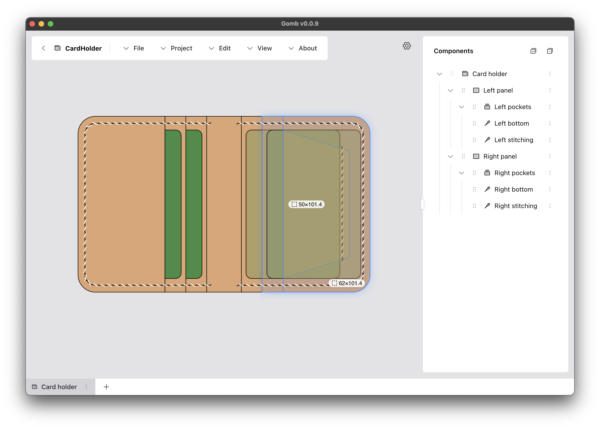
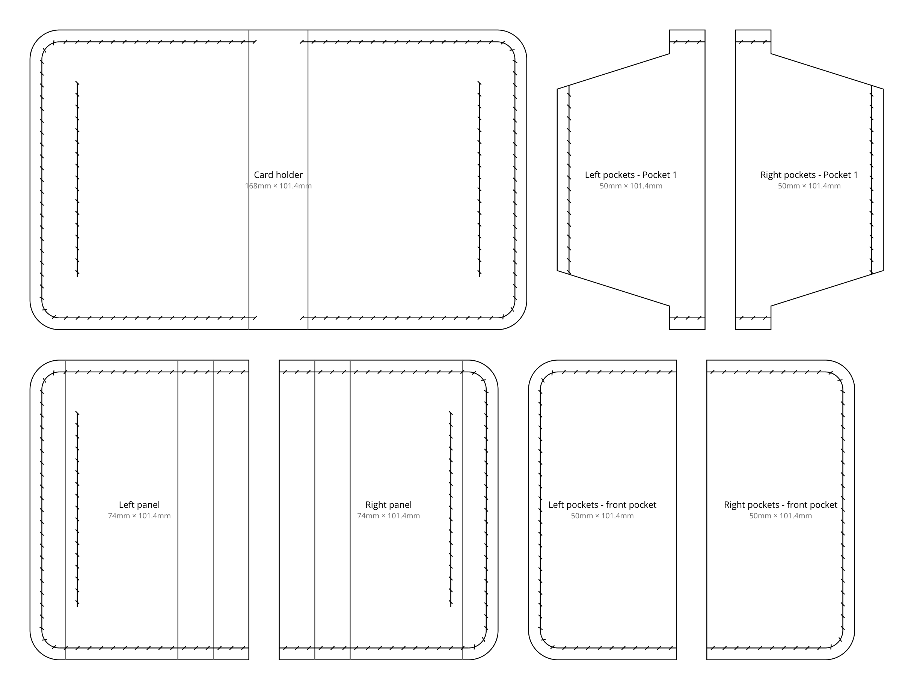

# Gomb



## What is Gomb?

Gomb is a free, source-available program for designing leather projects made from flat pieces, such as card holders and wallets. It works best for designs built from panels and pockets with straight or rounded edges.

Gomb lets you design an item as an assembled whole while keeping track of the individual pieces needed to make it. You can adjust the shape and placement of those pieces and plan where they will be stitched together. When the design is ready, Gomb lays out the pieces as printable patterns.

## From design to pattern

The card holder shown above can be exported as separate pieces, with dimensions and stitching marks:



Export the pattern as a PDF for printing or as an SVG for further editing.

## Download and try it

- Web version (fully functional, runs in the browser): https://bali182.github.io/gomb
- Electron version (Windows and Mac): https://github.com/bali182/gomb/releases/latest

## Development

To run and develop Gomb locally, you need node and npm:

```sh
git clone https://github.com/bali182/gomb.git
cd gomb
npm ci
npm run start:electron
```

To run the web version instead, use `npm run start:web`.

## License and usage

Gomb is free and source-available. TL;DR:

- No registration, no servers, no automatic updates.
- You own and store your data on your computer.
- You are free to do whatever you want with the source and the program - as long as you don't try to put a version of it behind a paywall for others. This program doesn't need to be SaaS or paid in general.
